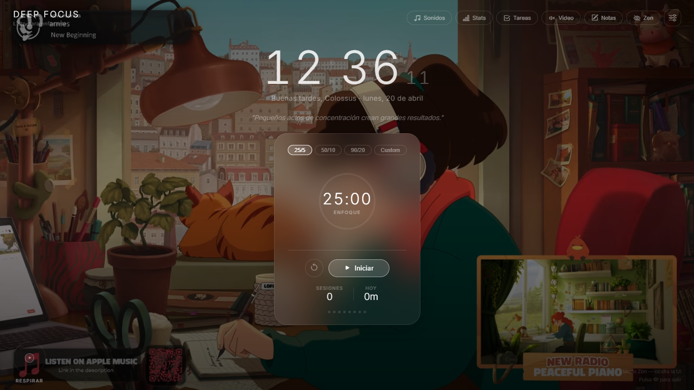

# 🧠 Deep Focus

Deep Focus es una aplicación web open source enfocada en mejorar la concentración al estudiar o trabajar. Combina videos lofi y relajantes con técnicas de productividad y herramientas de organización personal, todo desde el navegador.

El proyecto comenzó como una app personal pero estoy cansado de que tengamos que pagar por todo, así que si se te ocurre una funcionalidad que podria ser útil no dudes en hacer un fork y añadirla!

# ✨ Características principales

- 🎥 Videos lofi y relajantes: Contenido visual pensado para reducir distracciones y mantener el enfoque
- ⏱️ Pomodoro Timer: Sesiones de enfoque y descanso configurables basadas en la técnica Pomodoro
- ✅ Task List: Organización de pendientes con seguimiento de progreso
- 🎧 Sonidos para enfocarse: Sonidos ambientales para crear un entorno de concentración
- 📝 Notas: Anotaciones rápidas durante sesiones de estudio o trabajo
- 📊 Estadísticas: Registro del tiempo dedicado a estudiar o trabajar para analizar hábitos

# 🖼️ Capturas de pantalla

# 🚀 Instalación y ejecución

Este proyecto es una aplicación web creada con React + Vite. Aun sigo viendo como hostearla 😅

# Requisitos

- Node.js (versión recomendada: 18+)
- npm

# Pasos 

 ## Clonar el repositorio
[git clone https://github.com/tu-usuario/deep-focus.git](https://github.com/Alberto-Sotelo/DeepFocus.git)

## Entrar al proyecto
cd deep-focus

## Instalar dependencias
npm install

## Ejecutar en modo desarrollo
npm run dev

Luego abre tu navegador en la URL que Vite indique (normalmente http://localhost:5173).

# 🛠️ Tecnologías utilizadas

- Frontend: React
- Bundler / Dev Server: Vite
- Estilos: CSS / Tailwind CSS
- Almacenamiento: LocalStorage
- Multimedia: HTML5 Audio & Video APIs

# 📖 Uso

- Inicia la aplicación en el navegador.
- Selecciona un video lofi o sonido ambiental.
- Configura y comienza un Pomodoro.
- Gestiona tus tareas y notas.
- Consulta tus estadísticas para mejorar tu enfoque.

Si este proyecto te resulta útil, considera dejar una ⭐ en GitHub!!

